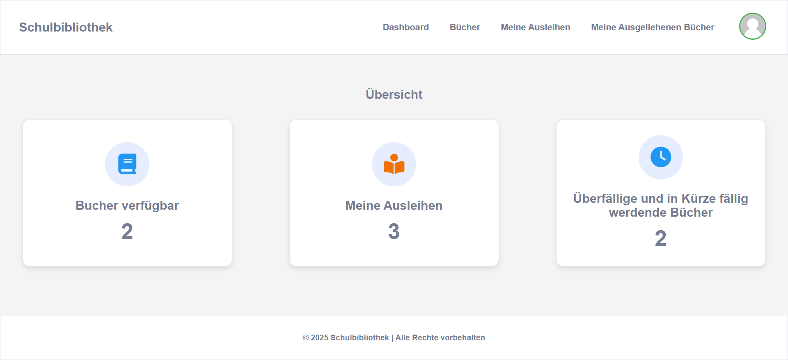

#  bibliothek-Management-System

Ein webbasiertes System zur Verwaltung einer bibliothek. Es ermöglicht die Verwaltung von Büchern, Ausleihvorgängen.

##  Funktionen

-  Buchverwaltung**: Hinzufügen, Bearbeiten und Löschen von Büchern  
-  Benutzerverwaltung**: Schülern   
-  Suche & Filter**: Einfache Suche nach Büchern anhand von Titel, Autor   
- Ausleihe & Rückgabe**: Bücher ausleihen und deren Status verfolgen  
- Dashboard**: Übersicht über die wichtigsten Daten der Bibliothek  

## Technologien

- **Frontend**: HTML5, CSS3, JavaScript  
- **Backend**: PHP (ohne Framework, reines MVC)  
- **Datenbank**: MySQL  
- **Architektur**: Model-View-Controller (MVC) 

## Screenshots
  

